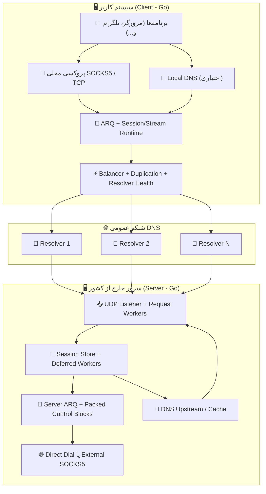
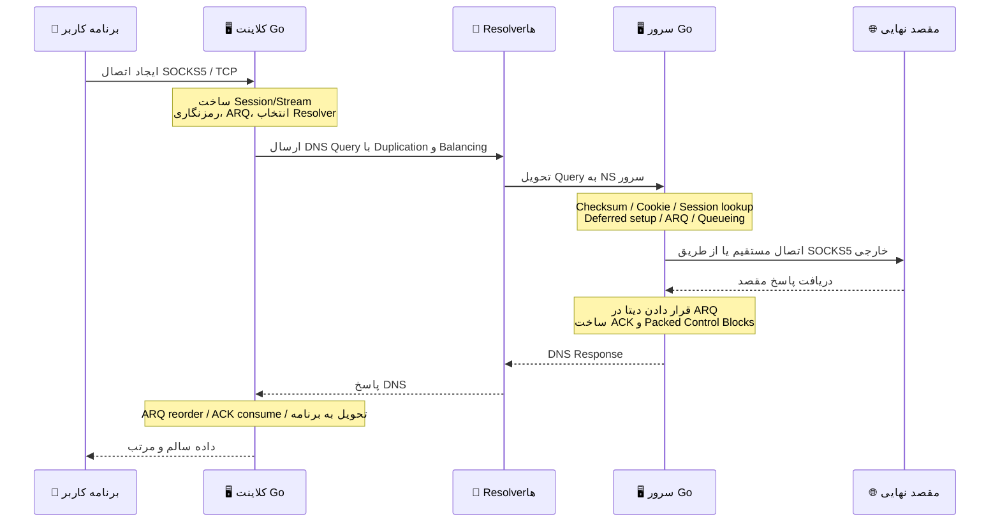

# پروژه MasterDnsVPN 🔐

## | [نسخه فارسی](https://github.com/masterking32/MasterDnsVPN/blob/main/README_FA.MD) | [English Version](https://github.com/masterking32/MasterDnsVPN/blob/main/README.MD) | 

پروژه **MasterDnsVPN** یک پروژهٔ علمی-تحقیقاتی برای انتقال داده‌های TCP از طریق درخواست‌ها و پاسخ‌های DNS است. این پروژه در هدف کلی شبیه پروژه‌هایی مانند DNSTT یا SlipStream است، اما از نظر ساختار و روش پیاده‌سازی تفاوت‌های بنیادین دارد و رویکرد متفاوتی را دنبال می‌کند.
پیاده‌سازی این سیستم بر پایهٔ سازگاری با انواع شبکه‌ها و رزولورها و نیز توانایی تحمل محدودیت‌های شدید طراحی شده است، تا در بدترین شرایط ممکن بالاترین میزان انتقال داده و بیشترین پایداری را فراهم کند.
اگرچه اصول طراحی پروژه قوی است، کیفیت و سرعت ارتباط به‌طور چشمگیری به موارد زیر وابسته است:
1. عملکرد رزولورها (سرعت Resolve، میزان MTU قابل پشتیبانی و...)
2. سرور خارجی شما (پینگ و سرعت ارتباط سرور با رزولورها و سخت‌افزار سرور)
3. کیفیت اینترنت شما (سرعت دسترسی به رزولورها و وجود رزولورهای مناسب)

از آنجا که تمام پروژه‌های مبتنی بر DNS نسبت به این عوامل حساسند، عملکرد MasterDnsVPN نیز بسته به شرایط فوق می‌تواند متفاوت باشد.

### 📊  مقایسه MasterDnsVPN با پروژه‌های مشابه:

| ویژگی | SlipStream | DNSTT | MasterDnsVPN |
| :--- | :--- | :--- | :--- |
| نوع پروتکل | DNS Tunnel پیشرفته | DNS Tunnel کلاسیک | DNS Tunnel / VPN پیشرفته |
| پروتکل انتقال | QUIC | KCP + Noise | پروتکل اختصاصی + ARQ |
| سربار هدرهای انتقالی | 🟠 ~24B | 🔴 ~59B | 🟢 ~5–7B (≈88% کمتر از DNSTT، ≈71% کمتر از SlipStream) |
| نوع رمزنگاری | TLS 1.3 (در QUIC) | Noise (Curve25519) | AES / ChaCha20 / XOR (در صورت استفاده از XOR: امنیت نسبی ولی بدون سربار اضافی) |
| معماری | یکپارچه (QUIC همه‌چیز را پوشش می‌دهد) | چندلایه (KCP + SMUX + Noise) | طراحی اختصاصی سبک، بهینه برای DNS |
| کارایی (سرعت) | 🟡 بالا (تا ~5× سریع‌تر از DNSTT) | 🔴 متوسط | 🟢 سازگار با شرایط بسیار بد؛ در بسیاری موارد عملکرد بهتر |
| پایداری در Packet Loss | 🟡 خوب | 🟠 متوسط | 🟢 بسیار بالا (Multipath + ARQ) |
| استفاده از چند DNS resolver | بله (multipath) | ❌ | بله — پیشرفته (multi-resolver + duplication) |
| تحمل سانسور شدید | خوب | متوسط | بسیار قوی (هدف اصلی پروژه) |
| پیچیدگی راه‌اندازی | متوسط | ساده | ساده؛ اما با پیکربندی پیشرفته قابل تنظیم و کمی پیچیده‌تر |
| پشتیبانی SOCKS5 | بله | بله | بهینه‌شده برای SOCKS5 / SOCKS4 |
| پشتیبانی Shadowsocks | ✅ | ❌ | غیرمستقیم: در حالت TCP Forwarding از پروتکل‌های TCP پشتیبانی می‌کند |
| Multipath واقعی | بله (QUIC multipath) | ❌ | بله (multi-resolver + duplication) |
| Adaptive routing | محدود | ❌ | پیشرفته (مبتنی بر latency/loss) |
| هدف طراحی | سرعت و کارایی بالا | سادگی و پایداری | عبور از محدودترین شبکه‌ها — پایداری، سرعت و کارایی |
| زبان پیاده‌سازی | Rust | Go | Python و Go |
| بالانسر داخلی | 🔴 | ❌ | 🟢 (4 نوع بالانسر داخلی) |
| سیستم Duplication | ❌ | ❌ | بله — افزایش ترافیک برای تضمین پایداری (قابل تنظیم) |
| MTU قابل پشتیبانی | بهتر از DNSTT | - | سازگار حتی با MTU کم به دلیل سربار بسیار پایین پروتکل |
| سیستم Failover | ❌ | ❌ | ✅ |
| بررسی سلامت رزولورها و غیرفعال‌سازی خودکار | ❌ | ❌ | ✅ |
| بازفعال‌سازی رزولورها در صورت دسترسی دوباره (پس‌زمینه) | ❌ | ❌ | ✅ |
| ارائه DNS محلی در کلاینت (جلوگیری از DNS Hijacking) | ❌ | ❌ | ✅ (با DNS Caching حرفه‌ای برای کاهش درخواست‌ها) |
| قابلیت DNS resolving از طریق SOCKS5 | ❌ | ❌ | ✅ (با DNS Caching) |
| امکان پیکربندی حرفه‌ای و دلخواه | 🟠 | 🟠 | 🟢 امکان پیکربندی دقیق تمام بخش‌ها |
| بی‌نیاز از نرم‌افزارهای جانبی | ❌ | ❌ | 🟢 نیازی به نصب نرم‌افزار جانبی نیست؛ در صورت نیاز می‌توانید از SOCKS یا ابزارهای خارجی مانند Shadowsocks یا OpenVPN استفاده کنید. |

---

### ❌ رفع مسئولیت (Disclaimer):
پروژه MasterDnsVPN صرفاً یک ایدهٔ علمی و آموزشی است و بر همین اساس طراحی و پیاده‌سازی شده است.

- **ارائه بدون ضمانت:** این نرم‌افزار «همان‌طور که هست» (AS-IS) و بدون هیچ‌گونه ضمانت صریح یا ضمنی، از جمله ضمانت قابلیت فروش، مناسب‌بودن برای هدف خاص یا عدم نقض حقوق، ارائه می‌شود.
- **محدودیت مسئولیت:** توسعه‌دهندگان و مشارکت‌کنندگان این پروژه هیچ‌گونه مسئولیتی در قبال خسارات مستقیم، غیرمستقیم، تبعی، اتفاقی یا هر نوع خسارت دیگری ناشی از استفاده یا ناتوانی در استفاده از این نرم‌افزار نمی‌پذیرند.
- **مسئولیت کاربر:** استفاده از این پروژه در محیط‌های غیرآزمایشگاهی ممکن است به ساختار شبکه آسیب برساند. کاربر به‌تنهایی مسئول هرگونه پیامد ناشی از نصب، پیکربندی و استفاده از این نرم‌افزار است.
- **رعایت قوانین:** استفاده از این پروژه برای دور زدن قوانین کشورها می‌تواند با مسئولیت‌های مدنی و کیفری همراه باشد. لطفاً پیش از استفاده، قوانین و مقررات کشور خود را در این زمینه به‌دقت بررسی کنید. توسعه‌دهندگان هیچ مسئولیتی در قبال نقض قوانین محلی، ملی یا بین‌المللی توسط کاربران نمی‌پذیرند.
- **مجوز استفاده:** استفاده، کپی، توزیع یا تغییر این نرم‌افزار مشمول شرایط مجوز مندرج در فایل `LICENSE` این مخزن است. هرگونه استفاده خارج از چارچوب آن مجوز ممنوع است. 

---

## کانال اطلاع‌رسانی و پشتیبانی 📢

برای دریافت آخرین اخبار، نسخه‌ها و اطلاعیه‌های پروژه، کانال تلگرام ما را دنبال کنید: [Telegram Channel](https://t.me/masterdnsvpn)

---

### اگر از پروژه راضی‌اید، با دادن ستاره (⭐) در گیت‌هاب از ما حمایت کنید — این کار به دیده‌شدن پروژه کمک می‌کند.

---

### حمایت مالی (اختیاری) 💸

- شبکه TON:

`masterking32.ton`

- آدرس روی شبکه‌های EVM (ETH و سازگارها): 

`0x517f07305D6ED781A089322B6cD93d1461bF8652`

- شبکه TRC20 (TRON):

`TLApdY8APWkFHHoxebxGY8JhMeChiETqFH`

از هر نوع حمایت و بازخورد شما سپاسگزاریم — کمک‌ها برای توسعه و بهبود پروژه بسیار ارزشمند است.

---

## ویژگی‌های کلیدی و مزایا ✨

نمای کلی و مختصر از قابلیت‌های اصلی MasterDnsVPN:

- **عبور از سانسور و تحمل شرایط سخت شبکه:** 🛡️ طراحی‌شده برای کار در شبکه‌های دارای فیلترینگ، قطعی و محدودیت MTU.
- **پروتکل سبک و کم‌سربار:** 🔄 پروتکل اختصاصی با مکانیزم ارسال مجدد برای کاهش سربار و افزایش ظرفیت داده در DNS.
- **قابلیت Multipath و تکثیر بسته‌ها:** 📡 ارسال همزمان از مسیرهای مختلف و تکثیر انتخابی برای افزایش شانس تحویل در شبکه‌های ناپایدار.
- **انتخاب هوشمند رزولورها و بررسی سلامت:** ⚡ انتخاب بر اساس کیفیت و وضعیت رزولورها و مدیریت خودکار رزولورهای مشکل‌دار.
- **کشف و همگام‌سازی MTU:** 🧰 تشخیص MTU عملیاتی مسیرها و تنظیم برای کاهش fragmentation و افزایش پایداری.
- **پشتیبانی و بهینه‌سازی SOCKS5/SOCKS4:** 🧦 مسیردهی و پردازش بهینه ترافیک پراکسی محلی برای برنامه‌ها.
- **تجمیع کنترل‌ها و کاهش سربار پاسخ‌ها:** 📦 جمع‌آوری ACK و پیام‌های کنترلی در یک پکت برای کاهش ترافیک کنترل.
- **فشرده‌سازی و تجمیع درخواست‌ها (اختیاری):** 🗜️ کاهش تعداد درخواست‌ها و افزایش بهره‌وری در شرایط MTU کوچک.
- **رمزنگاری انعطاف‌پذیر:** 🔐 پشتیبانی از چند الگوریتم رمزنگاری برای متعادل‌سازی سرعت و امنیت.
- **قابلیت DNS محلی و کشینگ در کلاینت:** 📛 ارائه DNS محلی، کاهش تأخیر و جلوگیری از حملات hijack.
- **مقیاس‌پذیری و کنترل منابع:** ⚙️ قابل اجرا از سرورهای کم‌منابع تا محیط‌های با بار زیاد.

این فهرست نمای کلی و مختصری از قابلیت‌هاست؛ برای جزئیات بیشتر به بخش‌های مرتبط در همین سند مراجعه کنید.

---

# راه‌اندازی و شروع بکار 🧑‍💻


## بخش ۱: 🖥️ راه‌اندازی سرور

### بخش ۱.۱: 🌐 راه‌اندازی و آماده‌سازی دامنه (پیش‌نیاز) 

برای دریافت مستقیم درخواست‌های DNS روی سرور باید یک زیردامنه را به سرورتان واگذار (delegate) کنید. به‌صورت خلاصه دو رکورد بسازید: یک رکورد `A` برای آدرس سرور و یک رکورد `NS` که زیردامنه را به آن A ارجاع دهد.

#### گام ۱.۱.۱: 🅰️ ساخت رکورد A (آدرس سرور) 

- **نوع:** `A`
- **نام:** نام کوتاه مثل `ns`
- **مقدار:** آدرس IPv4 سرور شما

> مثال: `ns.example.com -> 1.2.3.4`

> در Cloudflare - ⚠️ نکته سریع: اگر دامنه روی Cloudflare است، در صفحه `DNS` روی آیکون ابر کنار رکورد `A` کلیک کنید تا خاکستری (DNS only) شود؛ نباید Proxied (نارنجی) باشد.

#### گام ۱.۱.۲: 🏷️ ساخت رکورد NS (واگذاری زیردامنه)

- **نوع:** `NS`
- **نام:** زیردامنه‌ی تونل مثل `v`
- **مقدار (Target):** `ns.example.com`

> مثال: `v.example.com -> ns.example.com`

> در Cloudflare - ⚠️ نکته سریع: رکورد `NS` را اضافه کنید؛ Cloudflare رکورد NS را پروکسی نمی‌کند، فقط مطمئن شوید رکورد `ns` قبلاً روی DNS only قرار دارد.

#### بخش ۱.۱.۳: 💡 نکتهٔ کوتاه دربارهٔ MTU

هر چه نام‌های دامنه کوتاه‌تر باشند، فضای بیشتری برای داده در هر DNS request باقی می‌ماند. برای throughput بهتر از نام‌های کوتاه استفاده کنید. اگر از Cloudflare استفاده می‌کنید، باز هم رکوردها را DNS only نگه دارید.

---

### بخش ۱.۲: 🐧 نصب سریع سرور لینوکس

#### گام ۱.۲.۱: نصب خودکار (اسکریپت)

اگر قصد دارید سرور را روی یک سیستم لینوکسی راه‌اندازی کنید، ساده‌ترین راه استفاده از اسکریپت نصب خودکار است. کافی است دستور زیر را در ترمینال سرور وارد کنید:

```bash
bash <(curl -Ls https://raw.githubusercontent.com/masterking32/MasterDnsVPN/main/server_linux_install.sh)
```

این اسکریپت مراحل نصب و پیکربندی را خودکار انجام می‌دهد. بعد از پایان نصب، سرور اجرا می‌شود و **کلید رمزنگاری** در لاگ ترمینال نمایش داده می‌شود و همچنین در فایل `encrypt_key.txt` کنار فایل اجرایی ذخیره می‌گردد — این کلید را در جای امن نگه دارید.

#### گام ۱.۲.۲: نکات مهم پس از نصب

- در هنگام نصب از شما آدرس دامنه پرسیده می‌شود؛ باید همان زیردامنه‌ای باشد که در رکورد `NS` تنظیم کرده‌اید (مثلاً `v.example.com`).
- پس از ایجاد رکوردهای DNS، تا انتشار آن‌ها صبر کنید (ممکن است از چند دقیقه تا چند ساعت یا در موارد خاص تا 48 ساعت طول بکشد؛ بسته به TTL).
- برای بررسی صحت تنظیمات DNS می‌توانید از ابزارهایی مانند `dig` یا `nslookup` استفاده کنید (مثلاً `dig v.example.com NS` یا `nslookup -type=ns v.example.com`). برای پرس‌وجو مستقیم از nameserver جدید: `dig @ns.example.com v.example.com A`.
- اگر فایروال سرور فعال است، اجازه‌ی عبور UDP پورت 53 را بدهید. نمونه برای `ufw`:

```bash
sudo ufw allow 53/udp
sudo ufw reload
```

برای `firewalld`:

```bash
sudo firewall-cmd --add-port=53/udp --permanent
sudo firewall-cmd --reload
```

- اگر پورت `53` توسط سرویس دیگری اشغال شده باشد (مثلاً `systemd-resolved` در برخی توزیع‌ها)، راه‌حل را در بخش «رفع مشکل اشغال بودن پورت ۵۳» ببینید.
- کلید رمزنگاری (`encrypt_key.txt`) پس از نصب نمایش داده می‌شود؛ آن را کپی و امن نگه دارید، زیرا برای اتصال کلاینت لازم است.

---

## بخش ۲: 🚀 نصب و راه‌اندازی (کلاینت و سرور) 

شما می‌توانید این پروژه را به دو روش نصب و اجرا کنید:

1. استفاده از فایل‌های کامپایل‌شدهٔ آماده (مناسب اکثر کاربران)
2. اجرای مستقیم از روی سورس با **Go** (مناسب توسعه دهندگان)

---

### بخش ۲.۱: استفاده از نسخه‌های کامپایل‌شده (✅ روش پیشنهادی)

برای راحتی شما، فایل‌های اجرایی کلاینت و سرور از قبل در releaseها منتشر می‌شوند. کافی است نسخه مناسب سیستم‌عامل خود را دانلود و از حالت فشرده خارج کنید.

> 💡 **نکته:** بسته‌های release معمولاً شامل فایل اجرایی و فایل‌های نمونه‌ی کانفیگ هستند.

#### لینک‌های دانلود کلاینت (Client) 📥

| سیستم‌عامل (OS) | پردازنده (Architecture) | مناسب برای سیستم‌های... | لینک دانلود مستقیم |
| :--- | :--- | :--- | :--- |
| ویندوز (Windows) 🪟 | `AMD64` (64-bit) | ویندوز ۱۰ و ۱۱ | [دانلود نسخه ویندوز ⬇️](https://github.com/masterking32/MasterDnsVPN/releases/latest/download/MasterDnsVPN_Client_Windows_AMD64.zip) |
| مک‌اواس (macOS) 🍎 | `ARM64` | مک‌های جدید (سری M1 / M2 / M3) | [دانلود نسخه مک (Apple Silicon) ⬇️](https://github.com/masterking32/MasterDnsVPN/releases/latest/download/MasterDnsVPN_Client_MacOS_ARM64.zip) |
| لینوکس (Linux) 🐧 | `AMD64` (64-bit) | توزیع‌های جدید (اوبونتو ۲۲.۰۴+، دبیان ۱۲+) | [دانلود نسخه لینوکس (جدید) ⬇️](https://github.com/masterking32/MasterDnsVPN/releases/latest/download/MasterDnsVPN_Client_Linux_AMD64.zip) |
| لینوکس (Legacy) 🐧 | `AMD64` (64-bit) | توزیع‌های قدیمی (اوبونتو ۲۰.۰۴، دبیان ۱۱) | [دانلود نسخه لینوکس (سازگاری بالا) ⬇️](https://github.com/masterking32/MasterDnsVPN/releases/latest/download/MasterDnsVPN_Client_Linux-Legacy_AMD64.zip) |
| لینوکس (ARM) 🐧 | `ARM64` | سرورهای ARM، رزبری‌پای و بردهای مشابه | [دانلود نسخه لینوکس (ARM) ⬇️](https://github.com/masterking32/MasterDnsVPN/releases/latest/download/MasterDnsVPN_Client_Linux_ARM64.zip) |

#### لینک‌های دانلود سرور (Server) 📤

*(اگر نمی‌خواهید از اسکریپت نصب خودکار لینوکس استفاده کنید.)*

| سیستم‌عامل (OS) | پردازنده (Architecture) | مناسب برای سیستم‌های... | لینک دانلود مستقیم |
| :--- | :--- | :--- | :--- |
| ویندوز (Windows) 🪟 | `AMD64` (64-bit) | ویندوز سرور، ویندوز ۱۰ و ۱۱ | [دانلود سرور ویندوز ⬇️](https://github.com/masterking32/MasterDnsVPN/releases/latest/download/MasterDnsVPN_Server_Windows_AMD64.zip) |
| لینوکس (Linux) 🐧 | `AMD64` (64-bit) | سرورهای اوبونتو ۲۲.۰۴+، دبیان ۱۲+ | [دانلود سرور لینوکس (جدید) ⬇️](https://github.com/masterking32/MasterDnsVPN/releases/latest/download/MasterDnsVPN_Server_Linux_AMD64.zip) |
| لینوکس (Legacy) 🐧 | `AMD64` (64-bit) | سرورهای قدیمی (اوبونتو ۲۰.۰۴، دبیان ۱۱) | [دانلود سرور لینوکس (سازگاری بالا) ⬇️](https://github.com/masterking32/MasterDnsVPN/releases/latest/download/MasterDnsVPN_Server_Linux-Legacy_AMD64.zip) |
| لینوکس (ARM) 🐧 | `ARM64` | سرورهای ARM | [دانلود سرور لینوکس (ARM) ⬇️](https://github.com/masterking32/MasterDnsVPN/releases/latest/download/MasterDnsVPN_Server_Linux_ARM64.zip) |
| مک‌اواس (macOS) 🍎 | `ARM64` | مک‌های جدید (سری M1 / M2 / M3) | [دانلود سرور مک (Apple Silicon) ⬇️](https://github.com/masterking32/MasterDnsVPN/releases/latest/download/MasterDnsVPN_Server_MacOS_ARM64.zip) |

---

### بخش ۲.۲: 🪟 آماده‌سازی و اجرای کلاینت در ویندوز

- پس از دانلود نسخه مربوط به ویندوز آن را از حالت فشرده خارج کنید.
- فایل client_config.toml را با ویرایشگر متن نظیر Notepad باز کنید.
- در این فایل بجای مقادیر پیش‌فرض، مقادیر زیر را تنظیم کنید:
  - مقدار `ENCRYPTION_KEY` را با کلیدی که در هنگام نصب سرور دریافت کرده‌اید یکی کنید (یا محتوای `encrypt_key.txt` سرور را در اینجا قرار دهید).
  - مقدار `DOMAINS` را با دامنه‌ای که در رکورد NS تنظیم کرده‌اید یکی کنید (مثلاً `["v.example.com"]` و باید با رکورد NS سرور یکی باشد).
- فایل `client_resolvers.txt` را باز کنید و لیست رزولورها (resolvers) را وارد کنید؛ هر خط یک رزولور با فرمت `IP`، `IP:PORT`، `CIDR` یا `CIDR:PORT` (مثلاً `8.8.8.8` یا `8.8.8.8:53`).

> ⚠️ **نکته:**  شما باید لیست رزولورهایی که قابلیت انتقال اطلاعات به سرور شما را دارند پیدا کنید و در این فایل قرار دهید.

- سپس فایل `MasterDnsVPN_Client_Windows_AMD64.exe` را اجرا کنید. اگر همه چیز درست تنظیم شده باشد، کلاینت به سرور متصل می‌شود و آماده استفاده است.
- حالا می‌توانید تنظیمات ساکس برنامه‌های خود را روی `127.0.0.1:18000` تنظیم کنید و از اتصال VPN مبتنی بر DNS استفاده کنید.

> ⚠️ **نکته مهم:** روش پیدا کردن لیست Resolver ها در انتهای این مقاله بهش اشاره شده است.
---

### بخش ۲.۳: 🐧 آماده‌سازی و اجرا در لینوکس

- پس از دانلود نسخه مربوط به لینوکس، فایل ZIP را استخراج کنید، برای اینکار ابتدا برنامه های مورد نیاز را نصب کنید:

```bash
sudo apt update
sudo apt install unzip nano screen -y
```
سپس فایل را استخراج کنید:

```bash
unzip MasterDnsVPN_Client_Linux_AMD64.zip
ls
```
- در صورت نیاز مجوز اجرا بدهید:

```bash
chmod +x MasterDnsVPN_Client_Linux_AMD64
```
- فایل تنظیمات را ویرایش کنید:

```bash
nano client_config.toml
```

- در این فایل بجای مقادیر پیش‌فرض، مقادیر زیر را تنظیم کنید:
  - مقدار `ENCRYPTION_KEY` را با کلیدی که در هنگام نصب سرور دریافت کرده‌اید یکی کنید (یا محتوای `encrypt_key.txt` سرور را در اینجا قرار دهید).
  - مقدار `DOMAINS` را با دامنه‌ای که در رکورد NS تنظیم کرده‌اید یکی کنید (مثلاً `["v.example.com"]` و باید با رکورد NS سرور یکی باشد).

- فایل `client_resolvers.txt` را باز کنید و لیست ریزالورهای خود را وارد کنید، هر خط یک ریزالور با فرمت `IP`، `IP:PORT`، `CIDR` یا `CIDR:PORT` (مثلاً `8.8.8.8` یا `8.8.8.8:53`).

> ⚠️ **نکته:**  شما باید لیست ریزالورهایی که قابلیت انتقال اطلاعات به سرور شما را دارند پیدا کنید و در این فایل قرار دهید.

#### بخش ۲.۳.۱: اجرای کلاینت در پس‌زمینه

##### بخش ۲.۳.۱.۱: استفاده از `screen` برای اجرای در پس‌زمینه
- حالا می‌توانید فایل اجرایی را اجرا کنید، توصیه می‌شود برای اجرای سرور و کلاینت در پس‌زمینه از `screen` استفاده کنید تا در صورت قطع اتصال SSH، برنامه‌ها همچنان اجرا بمانند:
```bash
screen -S MasterDnsVPN
./MasterDnsVPN_Client_Linux_AMD64
```
برای خروج از صفحه `screen` و برگشت به ترمینال اصلی، کلیدهای `Ctrl + A` را فشار دهید و سپس `D` را بزنید. برای بازگشت به صفحه `screen` و دیدن لاگ‌ها یا متوقف کردن برنامه، دستور زیر را وارد کنید:
```bash
screen -r MasterDnsVPN
```

##### بخش ۲.۳.۱.۲: تبدیل به سرویس systemd

همچنین میتوانید نسخه کلاینت را به سرویس systemd تبدیل کنید تا همیشه در پس‌زمینه اجرا باشد، برای اینکار فایل سرویس زیر را ایجاد کنید:

```bash
sudo nano /etc/systemd/system/masterdnsvpn-client.service
```

و محتوای زیر را در آن قرار دهید (مطمئن شوید مسیر فایل اجرایی درست است):

```ini
[Unit]
Description=MasterDnsVPN Client Service
After=network.target
[Service]
Type=simple
ExecStart=/path/to/MasterDnsVPN_Client_Linux_AMD64 -config /path/to/client_config.toml
Restart=on-failure
[Install]
WantedBy=multi-user.target
```
سپس سرویس را فعال و اجرا کنید:

```bash
sudo systemctl daemon-reload
sudo systemctl enable masterdnsvpn-client
sudo systemctl start masterdnsvpn-client
```

همچنین برای دیدن لاگ‌ها می‌توانید از دستور زیر استفاده کنید:

```bash
sudo journalctl -u masterdnsvpn-client -f
```

### بخش ۲.۴: 🍎 آماده‌سازی و اجرا در مک

- پس از دانلود نسخه مربوط به مک، فایل ZIP را استخراج کنید.
- فایل `client_config.toml` را با ویرایشگر متن باز کنید (مثلاً با TextEdit یا nano در ترمینال) و مقادیر زیر را تنظیم کنید:
    - مقدار `ENCRYPTION_KEY` را با کلیدی که در هنگام نصب سرور دریافت کرده‌اید یکی کنید (یا محتوای `encrypt_key.txt` سرور را در اینجا قرار دهید).
    - مقدار `DOMAINS` را با دامنه‌ای که در رکورد NS تنظیم کرده‌اید یکی کنید (مثلاً `["v.example.com"]` و باید با رکورد NS سرور یکی باشد).

- فایل `client_resolvers.txt` را باز کنید و لیست ریزالورهای خود را وارد کنید، هر خط یک ریزالور با فرمت `IP`، `IP:PORT`، `CIDR` یا `CIDR:PORT` (مثلاً `8.8.8.8` یا `8.8.8.8:53`).

> ⚠️ **نکته:**  شما باید لیست ریزالورهایی که قابلیت انتقال اطلاعات به سرور شما را دارند پیدا کنید و در این فایل قرار دهید.

- سپس فایل `MasterDnsVPN_Client_MacOS_ARM64` را اجرا کنید. اگر همه چیز درست تنظیم شده باشد، کلاینت به سرور متصل می‌شود و آماده استفاده است.
- حالا می‌توانید تنظیمات ساکس برنامه‌های خود را روی `127.0.0.1:1080` قرار دهید.

---

#### بخش ۲.۵: 🐈‍⬛ پارامترهای خط فرمان (Command-line) برای کلاینت و سرور

هر دو باینری از این پارامترها پشتیبانی می‌کنند:

| پارامتر | توضیح |
| :--- | :--- |
| `-config` | مسیر فایل تنظیمات |
| `-log` | مسیر فایل لاگ اختیاری |
| `-version` | نمایش نسخه و خروج |

نمونه:

```bash
./masterdnsvpn-server -config server_config.toml -log server.log
./masterdnsvpn-client -config client_config.toml -log client.log
```

---

# بخش ۳: 🛠️ ساختار فایل‌های تنظیمات (Config) 

## بخش ۳.۱: 📂 فایل‌های مهم پروژه 

| فایل | کاربرد |
| :--- | :--- |
| `client_config.toml` | تنظیمات اصلی کلاینت |
| `server_config.toml` | تنظیمات اصلی سرور |
| `client_resolvers.txt` | لیست resolverها |
| `encrypt_key.txt` | کلید مشترک سمت سرور |
| `client_config.toml.simple` | نمونه کانفیگ کامل کلاینت |
| `server_config.toml.simple` | نمونه کانفیگ کامل سرور |

---
## بخش ۳.۲: 🧾 فایل لیست رزولورها (`client_resolvers.txt`) 
فرمت قابل قبول در `client_resolvers.txt`:

- `IP`
- `IP:PORT`
- `CIDR`
- `CIDR:PORT`

نمونه:

```text
8.8.8.8
1.1.1.1:53
9.9.9.0/24
208.67.222.0/24:5353
```

---


## بخش ۳.۴: 📖 جدول متغیرهای پیکربندی کلاینت (`client_config.toml`) 

### هویت تونل و امنیت

| پارامتر | مقدار نمونه | مقادیر مجاز | توضیح |
| :--- | :--- | :--- | :--- |
| `DOMAINS` | `["v.domain.com"]` | لیست رشته | دامنه‌هایی که کلاینت برای ساخت query استفاده می‌کند. باید با دامنه سرور یکی باشد. |
| `DATA_ENCRYPTION_METHOD` | `1` | `0` تا `5` | `0=None`، `1=XOR`، `2=ChaCha20`، `3=AES-128-GCM`، `4=AES-192-GCM`، `5=AES-256-GCM` |
| `ENCRYPTION_KEY` | `""` | رشته | کلید مشترک بین کلاینت و سرور |

### پروکسی محلی

| پارامتر | مقدار نمونه | مقادیر مجاز | توضیح |
| :--- | :--- | :--- | :--- |
| `PROTOCOL_TYPE` | `"SOCKS5"` | `"SOCKS5"`, `"TCP"` | حالت اصلی و توصیه‌شده `SOCKS5` است. |
| `LISTEN_IP` | `"127.0.0.1"` | IP معتبر | آدرس bind پراکسی محلی |
| `LISTEN_PORT` | `18000` | پورت معتبر | پورت پراکسی محلی |
| `SOCKS5_AUTH` | `false` | `true/false` | احراز هویت پراکسی محلی |
| `SOCKS5_USER` | `"master_dns_vpn"` | رشته | نام کاربری پراکسی |
| `SOCKS5_PASS` | `"master_dns_vpn"` | رشته | رمز عبور پراکسی |

### Local DNS

| پارامتر | مقدار نمونه | مقادیر مجاز | توضیح |
| :--- | :--- | :--- | :--- |
| `LOCAL_DNS_ENABLED` | `false` | `true/false` | فعال‌سازی DNS محلی روی کلاینت |
| `LOCAL_DNS_IP` | `"127.0.0.1"` | IP معتبر | آدرس bind DNS محلی |
| `LOCAL_DNS_PORT` | `53` | پورت معتبر | پورت DNS محلی |
| `LOCAL_DNS_CACHE_MAX_RECORDS` | `10000` | عدد صحیح مثبت | سقف رکوردهای cache محلی |
| `LOCAL_DNS_CACHE_TTL_SECONDS` | `14400.0` | عدد مثبت | TTL cache محلی |
| `LOCAL_DNS_PENDING_TIMEOUT_SECONDS` | `300.0` | عدد مثبت | timeout pendingهای DNS محلی |
| `DNS_RESPONSE_FRAGMENT_TIMEOUT_SECONDS` | `60.0` | عدد مثبت | timeout مونتاژ fragmentهای پاسخ DNS |
| `LOCAL_DNS_CACHE_PERSIST_TO_FILE` | `true` | `true/false` | ذخیره cache روی فایل |
| `LOCAL_DNS_CACHE_FLUSH_INTERVAL_SECONDS` | `60.0` | عدد مثبت | فاصله flush کردن cache روی فایل |

### انتخاب Resolver، Duplication و Health

| پارامتر | مقدار نمونه | مقادیر مجاز | توضیح |
| :--- | :--- | :--- | :--- |
| `RESOLVER_BALANCING_STRATEGY` | `0` | `0` تا `4` | `0/2=Round Robin`، `1=Random`، `3=Least Loss`، `4=Lowest Latency` |
| `PACKET_DUPLICATION_COUNT` | `2` | `1` تا `8` | تعداد تکثیر packetهای عادی |
| `SETUP_PACKET_DUPLICATION_COUNT` | `2` | `1` تا `8` | تعداد تکثیر packetهای setup |
| `STREAM_RESOLVER_FAILOVER_RESEND_THRESHOLD` | `2` | عدد صحیح مثبت | آستانه failover resolver ترجیحی stream |
| `STREAM_RESOLVER_FAILOVER_COOLDOWN` | `1.0` | عدد مثبت | حداقل فاصله بین دو failover |
| `RECHECK_INACTIVE_SERVERS_ENABLED` | `true` | `true/false` | recheck پس‌زمینه resolverهای غیرفعال |
| `RECHECK_INACTIVE_INTERVAL_SECONDS` | `60.0` | عدد مثبت | فاصله سیکل recheck کلی |
| `RECHECK_SERVER_INTERVAL_SECONDS` | `3.0` | عدد مثبت | فاصله recheck هر entry |
| `RECHECK_BATCH_SIZE` | `5` | عدد صحیح مثبت | تعداد resolverهایی که در هر batch بررسی می‌شوند |
| `AUTO_DISABLE_TIMEOUT_SERVERS` | `true` | `true/false` | حذف runtime resolverهای timeout-only |
| `AUTO_DISABLE_TIMEOUT_WINDOW_SECONDS` | `60.0` | عدد مثبت | بازه‌ای که اگر فقط timeout دیده شود resolver حذف می‌شود |
| `AUTO_DISABLE_MIN_OBSERVATIONS` | `6` | عدد صحیح مثبت | حداقل تعداد observation برای auto-disable |
| `AUTO_DISABLE_CHECK_INTERVAL_SECONDS` | `3.0` | عدد مثبت | فاصله بررسی auto-disable |
| `BASE_ENCODE_DATA` | `false` | `true/false` | base-safe کردن payload پیش از حمل در DNS |

### فشرده‌سازی

| پارامتر | مقدار نمونه | مقادیر مجاز | توضیح |
| :--- | :--- | :--- | :--- |
| `UPLOAD_COMPRESSION_TYPE` | `0` | `0` تا `3` | `0=OFF`، `1=ZSTD`، `2=LZ4`، `3=ZLIB` |
| `DOWNLOAD_COMPRESSION_TYPE` | `0` | `0` تا `3` | نوع فشرده‌سازی دانلود |
| `COMPRESSION_MIN_SIZE` | `120` | عدد صحیح مثبت | حداقل اندازه payload برای compression |

### MTU و تست اولیه

| پارامتر | مقدار نمونه | مقادیر مجاز | توضیح |
| :--- | :--- | :--- | :--- |
| `MIN_UPLOAD_MTU` | `40` | عدد صحیح مثبت | حداقل MTU قابل قبول آپلود |
| `MIN_DOWNLOAD_MTU` | `100` | عدد صحیح مثبت | حداقل MTU قابل قبول دانلود |
| `MAX_UPLOAD_MTU` | `150` | عدد صحیح مثبت | سقف جستجوی MTU آپلود |
| `MAX_DOWNLOAD_MTU` | `500` | عدد صحیح مثبت | سقف جستجوی MTU دانلود |
| `MTU_TEST_RETRIES` | `2` | عدد صحیح مثبت | تعداد retry هر probe |
| `MTU_TEST_TIMEOUT` | `2.0` | عدد مثبت | timeout هر probe |
| `MTU_TEST_PARALLELISM` | `24` | عدد صحیح مثبت | میزان parallelism تست MTU |
| `SAVE_MTU_SERVERS_TO_FILE` | `false` | `true/false` | ذخیره نتیجه‌ی resolverهای موفق روی فایل |
| `MTU_SERVERS_FILE_NAME` | `"masterdnsvpn_success_test_{time}.log"` | رشته | نام فایل خروجی تست |
| `MTU_SERVERS_FILE_FORMAT` | `"{IP} - UP: {UP_MTU} DOWN: {DOWN-MTU}"` | رشته | فرمت ثبت resolverهای موفق |
| `MTU_USING_SECTION_SEPARATOR_TEXT` | `""` | رشته | جداکننده اختیاری در فایل خروجی |
| `MTU_REMOVED_SERVER_LOG_FORMAT` | `"Resolver {IP} removed at {TIME} due to {CAUSE}"` | رشته | فرمت ثبت حذف resolver |
| `MTU_ADDED_SERVER_LOG_FORMAT` | `"Resolver {IP} added back at {TIME} (UP {UP_MTU}, DOWN {DOWN_MTU})"` | رشته | فرمت ثبت بازگشت resolver |

### Workerها، Queueها و Timerهای runtime

| پارامتر | مقدار نمونه | مقادیر مجاز | توضیح |
| :--- | :--- | :--- | :--- |
| `TUNNEL_READER_WORKERS` | `8` | عدد صحیح مثبت | تعداد workerهای خواندن |
| `TUNNEL_WRITER_WORKERS` | `8` | عدد صحیح مثبت | تعداد workerهای نوشتن |
| `TUNNEL_PROCESS_WORKERS` | `6` | عدد صحیح مثبت | تعداد workerهای پردازش |
| `TUNNEL_PACKET_TIMEOUT_SECONDS` | `10.0` | عدد مثبت | timeout کلی packet در runtime |
| `DISPATCHER_IDLE_POLL_INTERVAL_SECONDS` | `0.020` | عدد مثبت | فاصله polling dispatcher در زمان بیکاری |
| `TX_CHANNEL_SIZE` | `8192` | عدد صحیح مثبت | ظرفیت کانال TX |
| `RX_CHANNEL_SIZE` | `8192` | عدد صحیح مثبت | ظرفیت کانال RX |
| `RESOLVER_UDP_CONNECTION_POOL_SIZE` | `128` | عدد صحیح مثبت | اندازه pool UDP per resolver |
| `STREAM_QUEUE_INITIAL_CAPACITY` | `256` | عدد صحیح مثبت | ظرفیت اولیه queue stream |
| `ORPHAN_QUEUE_INITIAL_CAPACITY` | `64` | عدد صحیح مثبت | ظرفیت queue orphan |
| `DNS_RESPONSE_FRAGMENT_STORE_CAPACITY` | `512` | عدد صحیح مثبت | ظرفیت fragment store پاسخ DNS |
| `SOCKS_UDP_ASSOCIATE_READ_TIMEOUT_SECONDS` | `30.0` | عدد مثبت | timeout خواندن UDP ASSOCIATE |
| `CLIENT_TERMINAL_STREAM_RETENTION_SECONDS` | `45.0` | عدد مثبت | زمان نگهداری stream terminal |
| `CLIENT_CANCELLED_SETUP_RETENTION_SECONDS` | `120.0` | عدد مثبت | زمان نگهداری stream setup لغوشده |
| `SESSION_INIT_RETRY_BASE_SECONDS` | `1.0` | عدد مثبت | پایه retry برای session init |
| `SESSION_INIT_RETRY_STEP_SECONDS` | `1.0` | عدد مثبت | گام افزایش retry |
| `SESSION_INIT_RETRY_LINEAR_AFTER` | `5` | عدد صحیح مثبت | از این تعداد به بعد backoff خطی می‌شود |
| `SESSION_INIT_RETRY_MAX_SECONDS` | `60.0` | عدد مثبت | سقف delay retry |
| `SESSION_INIT_BUSY_RETRY_INTERVAL_SECONDS` | `60.0` | عدد مثبت | retry delay برای حالت SESSION_BUSY |

### Ping / Keepalive

| پارامتر | مقدار نمونه | توضیح |
| :--- | :--- | :--- |
| `PING_AGGRESSIVE_INTERVAL_SECONDS` | `0.300` | فاصله پینگ در حالت داغ |
| `PING_LAZY_INTERVAL_SECONDS` | `1.0` | فاصله پینگ در حالت عادی |
| `PING_COOLDOWN_INTERVAL_SECONDS` | `3.0` | فاصله پینگ در حالت cooldown |
| `PING_COLD_INTERVAL_SECONDS` | `30.0` | فاصله پینگ در حالت cold |
| `PING_WARM_THRESHOLD_SECONDS` | `5.0` | آستانه ورود از warm |
| `PING_COOL_THRESHOLD_SECONDS` | `10.0` | آستانه ورود به cool |
| `PING_COLD_THRESHOLD_SECONDS` | `20.0` | آستانه ورود به cold |

### ARQ و Packing

| پارامتر | مقدار نمونه | توضیح |
| :--- | :--- | :--- |
| `MAX_PACKETS_PER_BATCH` | `5` | سقف packed control block در هر batch |
| `ARQ_WINDOW_SIZE` | `600` | اندازه پنجره ARQ |
| `ARQ_INITIAL_RTO_SECONDS` | `0.5` | RTO اولیه data |
| `ARQ_MAX_RTO_SECONDS` | `6.0` | سقف RTO data |
| `ARQ_CONTROL_INITIAL_RTO_SECONDS` | `0.5` | RTO اولیه control |
| `ARQ_CONTROL_MAX_RTO_SECONDS` | `6.0` | سقف RTO control |
| `ARQ_MAX_CONTROL_RETRIES` | `120` | سقف retry control |
| `ARQ_INACTIVITY_TIMEOUT_SECONDS` | `1800.0` | timeout inactivity |
| `ARQ_DATA_PACKET_TTL_SECONDS` | `2400.0` | TTL packetهای data |
| `ARQ_CONTROL_PACKET_TTL_SECONDS` | `1200.0` | TTL packetهای control |
| `ARQ_MAX_DATA_RETRIES` | `1200` | سقف retry data |
| `ARQ_TERMINAL_DRAIN_TIMEOUT_SECONDS` | `120.0` | timeout drain terminal |
| `ARQ_TERMINAL_ACK_WAIT_TIMEOUT_SECONDS` | `90.0` | timeout انتظار ACK terminal |

### لاگ

| پارامتر | مقدار نمونه | مقادیر مجاز | توضیح |
| :--- | :--- | :--- | :--- |
| `LOG_LEVEL` | `"INFO"` | `DEBUG`, `INFO`, `WARN`, `ERROR` | سطح لاگ کلاینت |

---

## بخش ۳.۵: جدول متغیرهای پیکربندی سرور (`server_config.toml`) 📖

### سیاست تونل

| پارامتر | مقدار نمونه | مقادیر مجاز | توضیح |
| :--- | :--- | :--- | :--- |
| `DOMAIN` | `["v.domain.com"]` | لیست رشته | دامنه‌های این تونل. باید با `DOMAINS` کلاینت هماهنگ باشد. |
| `SUPPORTED_UPLOAD_COMPRESSION_TYPES` | `[0,1,2,3]` | لیست از `0` تا `3` | compressionهای مجاز آپلود |
| `SUPPORTED_DOWNLOAD_COMPRESSION_TYPES` | `[0,1,2,3]` | لیست از `0` تا `3` | compressionهای مجاز دانلود |

### UDP Listener و ظرفیت ورودی

| پارامتر | مقدار نمونه | توضیح |
| :--- | :--- | :--- |
| `UDP_HOST` | `"0.0.0.0"` | آدرس bind سرور |
| `UDP_PORT` | `53` | پورت UDP سرور |
| `UDP_READERS` | `4` | تعداد goroutineهای خواندن UDP |
| `DNS_REQUEST_WORKERS` | `24` | تعداد workerهای پردازش درخواست DNS |
| `MAX_CONCURRENT_REQUESTS` | `32768` | ظرفیت queue درخواست‌های ورودی |
| `SOCKET_BUFFER_SIZE` | `8388608` | اندازه بافر socket |
| `MAX_PACKET_SIZE` | `65535` | اندازه بافر packet pool |
| `DROP_LOG_INTERVAL_SECONDS` | `2.0` | فاصله لاگ overload/drop |

### Deferred Session Runtime

| پارامتر | مقدار نمونه | توضیح |
| :--- | :--- | :--- |
| `DEFERRED_SESSION_WORKERS` | `12` | تعداد workerهای deferred session |
| `DEFERRED_SESSION_QUEUE_LIMIT` | `8192` | ظرفیت queue deferred |
| `SESSION_ORPHAN_QUEUE_INITIAL_CAPACITY` | `128` | ظرفیت اولیه orphan queue |
| `STREAM_QUEUE_INITIAL_CAPACITY` | `256` | ظرفیت اولیه queue stream |
| `DNS_FRAGMENT_STORE_CAPACITY` | `512` | ظرفیت DNS fragment store |
| `SOCKS5_FRAGMENT_STORE_CAPACITY` | `1024` | ظرفیت SOCKS5 fragment store |

### چرخه عمر Session و Stream

| پارامتر | مقدار نمونه | توضیح |
| :--- | :--- | :--- |
| `INVALID_COOKIE_WINDOW_SECONDS` | `2.0` | پنجره invalid-cookie tracker |
| `INVALID_COOKIE_ERROR_THRESHOLD` | `10` | آستانه خطای invalid cookie |
| `SESSION_TIMEOUT_SECONDS` | `300.0` | timeout inactivity session |
| `SESSION_CLEANUP_INTERVAL_SECONDS` | `30.0` | فاصله cleanup session |
| `CLOSED_SESSION_RETENTION_SECONDS` | `600.0` | زمان نگهداری session بسته |
| `SESSION_INIT_REUSE_TTL_SECONDS` | `600.0` | زمان reuse امضای init |
| `RECENTLY_CLOSED_STREAM_TTL_SECONDS` | `600.0` | زمان نگهداری stream بسته‌شده |
| `RECENTLY_CLOSED_STREAM_CAP` | `2000` | سقف رکوردهای stream بسته |
| `TERMINAL_STREAM_RETENTION_SECONDS` | `45.0` | زمان نگهداری stream terminal |

### DNS Tunnel Upstream

| پارامتر | مقدار نمونه | توضیح |
| :--- | :--- | :--- |
| `DNS_UPSTREAM_SERVERS` | `["1.1.1.1:53", "1.0.0.1:53"]` | لیست DNS upstream برای DNS-over-tunnel |
| `DNS_UPSTREAM_TIMEOUT` | `4.0` | timeout هر lookup upstream |
| `DNS_INFLIGHT_WAIT_TIMEOUT_SECONDS` | `8.0` | timeout followerهای inflight lookup |
| `DNS_FRAGMENT_ASSEMBLY_TIMEOUT` | `300.0` | timeout مونتاژ fragmentهای DNS |
| `DNS_CACHE_MAX_RECORDS` | `50000` | سقف cache DNS داخل تونل |
| `DNS_CACHE_TTL_SECONDS` | `300.0` | TTL cache DNS داخل تونل |

### Forwarding و SOCKS خارجی

| پارامتر | مقدار نمونه | توضیح |
| :--- | :--- | :--- |
| `SOCKS_CONNECT_TIMEOUT` | `8.0` | timeout اتصال outbound |
| `USE_EXTERNAL_SOCKS5` | `false` | اگر `true` باشد از SOCKS5 خارجی استفاده می‌شود |
| `SOCKS5_AUTH` | `false` | احراز هویت برای SOCKS5 خارجی |
| `SOCKS5_USER` | `"admin"` | نام کاربری SOCKS5 خارجی |
| `SOCKS5_PASS` | `"123456"` | رمز عبور SOCKS5 خارجی |
| `FORWARD_IP` | `""` | IP پراکسی خارجی |
| `FORWARD_PORT` | `0` | پورت پراکسی خارجی |

### امنیت

| پارامتر | مقدار نمونه | مقادیر مجاز | توضیح |
| :--- | :--- | :--- | :--- |
| `DATA_ENCRYPTION_METHOD` | `1` | `0` تا `5` | باید با کلاینت یکی باشد |
| `ENCRYPTION_KEY_FILE` | `"encrypt_key.txt"` | مسیر فایل | مسیر فایل کلید سرور |

### ARQ، Packing و TTLهای کنترلی

| پارامتر | مقدار نمونه | توضیح |
| :--- | :--- | :--- |
| `MAX_PACKETS_PER_BATCH` | `20` | سقف بسته‌های packed control |
| `PACKET_BLOCK_CONTROL_DUPLICATION` | `2` | تعداد تکرار blockهای کنترلی packed |
| `STREAM_SETUP_ACK_TTL_SECONDS` | `400.0` | TTL ACKهای setup |
| `STREAM_RESULT_PACKET_TTL_SECONDS` | `300.0` | TTL پکت‌های result |
| `STREAM_FAILURE_PACKET_TTL_SECONDS` | `120.0` | TTL پکت‌های failure |
| `ARQ_WINDOW_SIZE` | `600` | اندازه پنجره ARQ |
| `ARQ_INITIAL_RTO_SECONDS` | `0.5` | RTO اولیه data |
| `ARQ_MAX_RTO_SECONDS` | `6.0` | سقف RTO data |
| `ARQ_CONTROL_INITIAL_RTO_SECONDS` | `0.5` | RTO اولیه control |
| `ARQ_CONTROL_MAX_RTO_SECONDS` | `6.0` | سقف RTO control |
| `ARQ_MAX_CONTROL_RETRIES` | `120` | سقف retry control |
| `ARQ_INACTIVITY_TIMEOUT_SECONDS` | `1800.0` | timeout inactivity |
| `ARQ_DATA_PACKET_TTL_SECONDS` | `2400.0` | TTL packetهای data |
| `ARQ_CONTROL_PACKET_TTL_SECONDS` | `1200.0` | TTL packetهای control |
| `ARQ_MAX_DATA_RETRIES` | `1200` | سقف retry data |
| `ARQ_TERMINAL_DRAIN_TIMEOUT_SECONDS` | `120.0` | timeout drain terminal |
| `ARQ_TERMINAL_ACK_WAIT_TIMEOUT_SECONDS` | `90.0` | timeout انتظار ACK terminal |

### لاگ

| پارامتر | مقدار نمونه | مقادیر مجاز | توضیح |
| :--- | :--- | :--- | :--- |
| `LOG_LEVEL` | `"INFO"` | `DEBUG`, `INFO`, `WARN`, `ERROR` | سطح لاگ سرور |

---

## بخش ۳.۶: درک بهتر از MTU و تنظیمات طلایی برای اجرای سریع ⚡

نسخه فعلی Go همچنان به‌شدت به MTU مناسب وابسته است. اگر MTU را خیلی بالا بگیرید:

- resolverهای بیشتری fail می‌شوند
- startup طولانی‌تر می‌شود
- fragmentation و loss بیشتر می‌شود

اگر خیلی پایین بگیرید:

- سرعت کم می‌شود
- اما پایداری بیشتر می‌شود

### پیشنهاد عملی

1. با sample config شروع کنید.
2. اجازه دهید کلاینت resolverها را تست کند.
3. خروجی MTU و تعداد resolverهای معتبر را ببینید.
4. اگر کیفیت بد است، `MIN_UPLOAD_MTU` و `MIN_DOWNLOAD_MTU` را کمی پایین‌تر بیاورید.
5. اگر می‌خواهید startup سریع‌تر شود، بازه `MIN/MAX` را محدودتر کنید.

---

## بخش ۴: راهنمای استفاده در موبایل (اندروید و آیفون) 📱

از آنجایی که در حال حاضر اپلیکیشن مستقیم برای اندروید یا iOS ارائه نشده، می‌توانید از طریق یکی از این روش‌ها از تونل روی گوشی استفاده کنید:

### روش اول: اشتراک‌گذاری پراکسی از روی کامپیوتر 📶

1. `LISTEN_IP` را روی `0.0.0.0` بگذارید.
2. کلاینت را روی کامپیوتر اجرا کنید.
3. گوشی و کامپیوتر را به یک شبکه وصل کنید.
4. در گوشی یک پروکسی **SOCKS5** با IP کامپیوتر و پورت `LISTEN_PORT` تنظیم کنید.

### روش دوم: اجرای کلاینت روی سرور واسط 🏗️

1. سرور اصلی را روی مقصد نهایی اجرا کنید.
2. کلاینت را روی سرور واسط اجرا کنید.
3. `LISTEN_IP` را روی `0.0.0.0` بگذارید.
4. از گوشی به SOCKS5 همان سرور واسط وصل شوید.

### روش سوم: ترکیب با پنل‌های دیگر 🛠️

اگر روی یک سرور، پنل یا سرویس دیگری دارید، می‌توانید outbound آن را به SOCKS5 لوکال کلاینت MasterDnsVPN بدهید و از آن به‌عنوان مسیر خروجی استفاده کنید.

### ⚠️ نکات مهم امنیتی برای موبایل

- اگر `LISTEN_IP = "0.0.0.0"` است، برای SOCKS5 احراز هویت بگذارید.
- اگر دستگاه‌ها به هم وصل نمی‌شوند، firewall سیستم را بررسی کنید.

---

## بخش ۵: نکات اضطراری و رفع مشکلات 🚨

### بخش ۵.۱: تنظیمات در شرایط loss شدید شبکه ⚠️

اگر network شما بسیار ناپایدار است:

1. تعداد resolverها را بیشتر کنید.
2. `PACKET_DUPLICATION_COUNT` را بالا ببرید.
3. balancing را روی `3` یا `4` امتحان کنید.
4. MTU را پایین‌تر بیاورید.
5. health system را روشن نگه دارید.

در شرایط خیلی سخت، duplicationهای بین `3` تا `6` معمولاً معقول‌اند، البته به‌قیمت مصرف بیشتر پهنای باند و CPU.

### بخش ۵.۲: رفع مشکل اشغال بودن پورت ۵۳ (در سرور لینوکس) 🛑

در اکثر توزیع‌های لینوکس، پورت `53` توسط `systemd-resolved` اشغال است. اگر سرور بالا نیامد:

```bash
sudo nano /etc/systemd/resolved.conf
```

و این مقدار را بگذارید:

```text
DNSStubListener=no
```

سپس:

```bash
sudo systemctl restart systemd-resolved
```

> ⚠️ **اخطار مهم:** روی یک سرور نمی‌توانید همزمان چند پروژه‌ی تونل DNS را روی پورت `53` اجرا کنید.

---

## بخش ۶: معماری و نحوهٔ کار سیستم 🛠️

پروژه **MasterDnsVPN** با ترکیب Session Multiplexing، Resolver Balancing، Packet Duplication، لایه‌ی ARQ اختصاصی و Deferred Session Runtime روی بستر UDP/DNS محدودیت‌های تونل‌های معمول را دور می‌زند.

### بخش ۶.۱: نمای کلی معماری دیاگرام 🌐



### بخش ۶.۲: جریان و چرخهٔ حیات پکت‌ها 🔄



### بخش ۶.۳: مفاهیم کلیدی استفاده‌شده 🧠

| مفهوم (Concept) | توضیح کارکرد در سیستم |
| :--- | :--- |
| **Session** | یک اتصال کلی بین کلاینت و سرور. |
| **Stream** | هر اتصال منطقی مستقل که روی Session حمل می‌شود. |
| **Resolver Runtime** | انتخاب resolver، duplication، health tracking، auto-disable و recheck |
| **ARQ** | ترتیب‌دهی، ACK، retransmit، timeout و terminal handling |
| **Deferred Session Runtime** | کارهای ordering-sensitive مثل setup، DNS query handling و packetهای حساس |
| **Packed Control Blocks** | تجمیع چند ACK یا control packet کوچک در یک block |
| **Synced MTU** | MTU مشترک انتخاب‌شده بین resolverهای معتبر |

---

## بخش ۷: نکات فنی پیشرفته ⚙️

- ⚡ **اتصال مستقیم یا از طریق SOCKS5 خارجی:** اگر `USE_EXTERNAL_SOCKS5 = false` باشد، سرور مستقیم به مقصد وصل می‌شود. اگر `true` باشد، از SOCKS5 خارجی عبور می‌کند.
- 🔄 **پینگ و پولینگ تطبیقی:** کلاینت با پروفایل‌های ping و dispatcher polling خودش بار idle را پایین نگه می‌دارد.
- 🧠 **Resolver failover روی هر stream:** اگر یک stream روی resolver بد گیر کند، resolver ترجیحی‌اش می‌تواند جابه‌جا شود.
- 📦 **تکرار blockهای کنترلی:** سرور می‌تواند آخرین packed control block را چند turn تکرار کند تا روی لینک lossy احتمال رسیدن ACKهای حیاتی بیشتر شود.
- 🔒 **کلید سمت سرور:** اگر `encrypt_key.txt` وجود نداشته باشد، سرور هنگام startup آن را می‌سازد.

---

## 🤝 مشارکت (Contributing)

ما از تمام مشارکت‌ها استقبال می‌کنیم. لطفاً اگر ایده، باگ یا بهبود عملکردی دارید، از طریق Issue یا Pull Request آن را مطرح کنید.

[Issues](https://github.com/masterking32/MasterDnsVPN/issues)

[Pull Requests](https://github.com/masterking32/MasterDnsVPN/pulls)

---

## 📄 مجوز (License)

این پروژه تحت مجوز **MIT** منتشر شده است. برای جزئیات بیشتر به فایل `LICENSE` مراجعه کنید.

---

## 👨‍💻 توسعه‌دهنده (Developer)

توسعه‌داده‌شده با ❤️ توسط: [**MasterkinG32**](https://github.com/masterking32)

